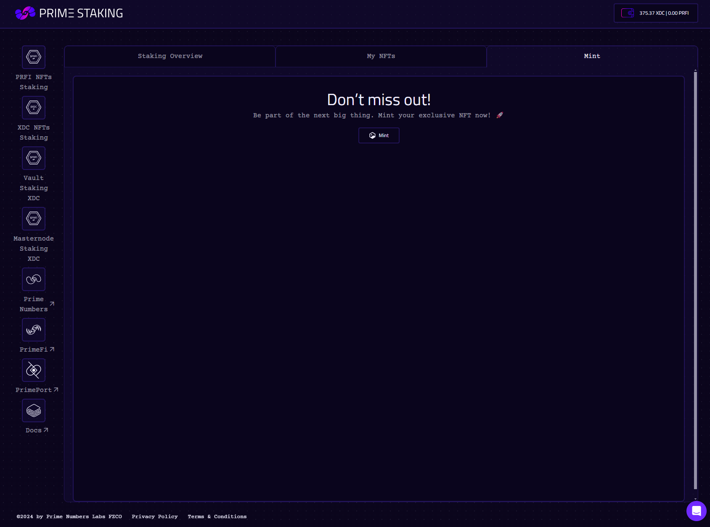

# Historical: pstXDC → psXDC migration


This page describes the **historical** migration from the original **pstXDC** token to **psXDC** (V1 → V2). The migration completed long ago and is kept here for archival reference only. If you still hold pstXDC, contact [admin@primenumbers.xyz](mailto:admin@primenumbers.xyz).

For the **current** migration from **V2 psXDC to V3 psXDC shares**, see [Migrate V2 psXDC → V3](../xdc-staking/xdc-nfts-staking-system-vaults/xdc-liquid-staking/staking-guide/migration.md).


If you hold the legacy **pstXDC** token, you can migrate it to the **psXDC** token.

---

### Steps

1. Go to the **Migration** section in the app.
2. Click **Migrate** and confirm the transaction.
3. Your pstXDC will be converted to psXDC at a 1:1 ratio.

<figure><figcaption></figcaption></figure>

<figure><figcaption></figcaption></figure>


Migration is only required for users who staked before the psXDC upgrade. New users receive psXDC directly. Once on psXDC, you can subsequently migrate to V3 — see the [V2 → V3 migration guide](../xdc-staking/xdc-nfts-staking-system-vaults/xdc-liquid-staking/staking-guide/migration.md).

