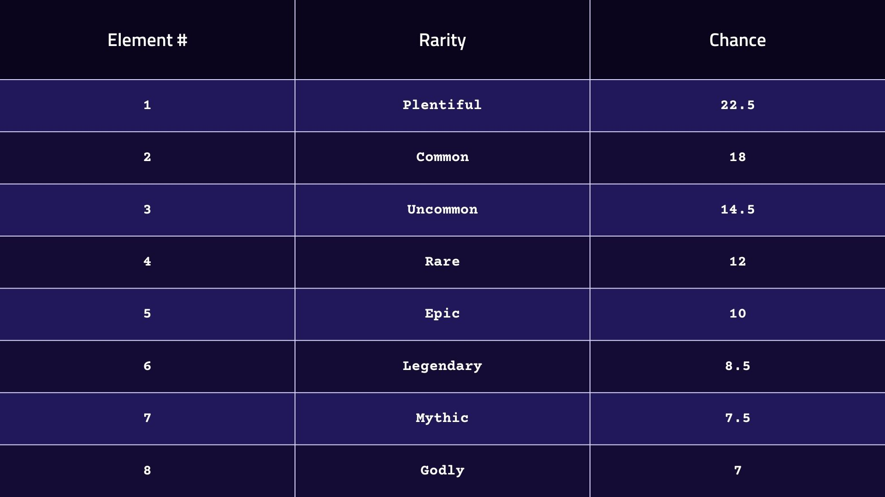
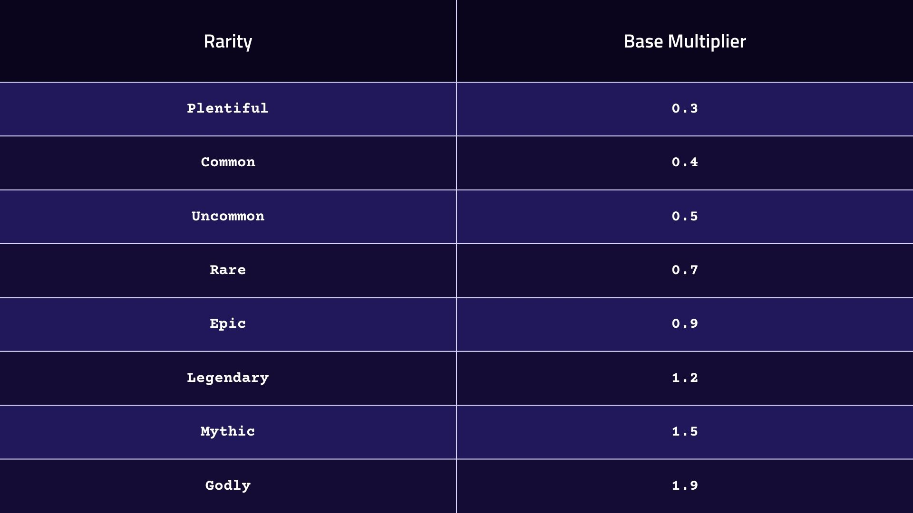

---
layout:
  title:
    visible: true
  description:
    visible: false
  tableOfContents:
    visible: true
  outline:
    visible: true
  pagination:
    visible: true
---

# PRFI Staking

<mark style="color:red;">**Note:**</mark> <mark style="color:red;"></mark><mark style="color:red;">Our NFTs are being migrated to a new network. Staking is paused during this migration.</mark>

## <mark style="color:purple;">Prime Numbers NFTs: A Unique Blend of Art and Financial Power</mark>

Our Prime Numbers NFT collection consists of 4,111 unique digital assets, including 4,096 generative NFTs and 15 handmade masterpieces. Each NFT in this collection is designed to offer both aesthetic value and financial utility.

During the PRFI Staking NFT minting period, only 2,333 NFTs were minted—half of the original intended supply. This early reduction in supply has significantly increased the value of the NFTs currently in circulation.&#x20;

<figure><figcaption></figcaption></figure>

***

### <mark style="color:blue;">Smart Contract Information</mark>

Prime Numbers PRFI NFT V3

[xdc134279d46ce98cca734d9a43cc3dda63a1ac755d](https://xdc.blocksscan.io/address/xdc134279d46ce98cca734d9a43cc3dda63a1ac755d)

### <mark style="color:blue;">Handmade Prime Numbers NFTs</mark>

The first 15 NFTs in our collection are handcrafted by [Olatz Diaz](https://olatzdiaz.com/), each representing one of the first 15 prime numbers. These one-of-a-kind artworks are irreplaceable and will never be minted again, making them highly coveted pieces for any serious collector.

<figure><figcaption>
Handmade Prime Numbers NFT #5
</figcaption></figure>

### <mark style="color:blue;">Generative Prime Numbers NFTs</mark>

The artwork of our generative NFTs consists of the following elements:

* a prime number
* sensual vegetation
* a geometric figure
* a feminine shape
* futuristic background lines
* A background color fades with complementing colors

The prime numbers were generated at minting time sequentially, starting at the 16th prime number up to the 4,111th prime number. Each generated number is unique.

The art elements behind the number graphic each have eight variations with a different rarity that has a certain chance of being randomly chosen.

The following chances are assigned to the different rarities:

<figure><figcaption></figcaption></figure>

This makes 8⁵ = 32,768 combinations possible, meaning many of the combinations were not minted, and the uniqueness factor of the minted NFTs will be very high.

Each generative NFT is unique, and there will be no others like it.

### <mark style="color:blue;">NFTs Rarity</mark>

The NFTs in our collection each have their own global rarity.  Combining the rarities of the segments determines the overall rarity of the NFT. Each rarity grants an increasing base multiplier when you stake.

Next, we explain how the rarity of each part of the NFT is calculated.

With the probability explained above, we take the five parts with their different rarities.

For example:

* sensual vegetation → Mythic (7)
* a geometric figure → Epic (5)
* a feminine shape → Legendary (6)
* futuristic background lines → Rare (4)
* A background color fade with complementing colors → Godly (8)

We do the following calculation: (7 + 5 + 6 + 4 + 8) / 5 = 5.8

We round up. Then our rarity will be Legendary (6).

Once the form of obtaining the rarity and how unique these NFTs are has been created, you can see below the table in which the multiplier that each NFT carries is detailed.

<figure><figcaption></figcaption></figure>

### <mark style="color:blue;">Staking and Rewards</mark>

Prime Numbers NFTs are not just for collection—they are powerful financial tools. When staked within the Prime Numbers Labs ecosystem, they generate consistent rewards, with the rarity of each NFT determining its staking multiplier.

### <mark style="color:blue;">Experience the Future of Digital Ownership</mark>

Prime Numbers NFTs are more than just digital art—they are valuable assets designed to appreciate over time while providing ongoing rewards. Join us and stake your claim in this unique collection.
