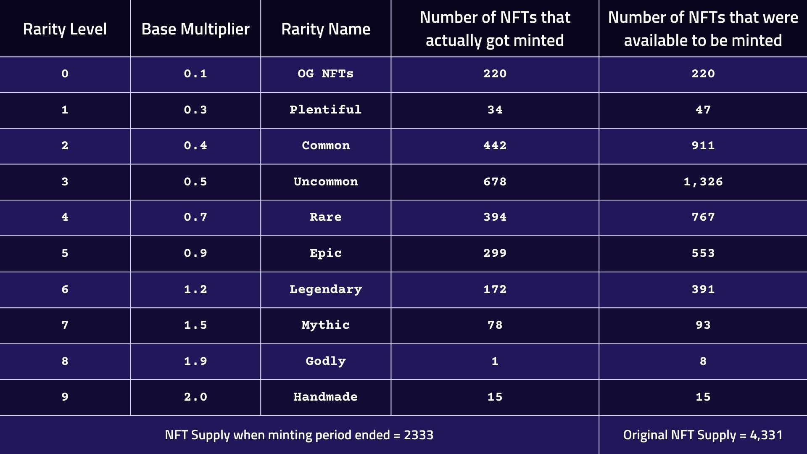

---
layout:
  title:
    visible: true
  description:
    visible: false
  tableOfContents:
    visible: true
  outline:
    visible: true
  pagination:
    visible: true
---

# PRFI Staking Mechanics

<mark style="color:red;">**Note:**</mark> <mark style="color:red;"></mark><mark style="color:red;">Our NFTs are being migrated to LayerZero Standard.</mark>&#x20;

## <mark style="color:purple;">Understanding PRFI Staking NFTs: Maximizing Your Rewards</mark>

Prime Numbers Labs introduces a revolutionary staking system where your $PRFI tokens can be staked inside NFTs, allowing you to earn various rewards. Here’s how it works:

***

### <mark style="color:purple;">How It Works</mark>

1. **Stake Your PRFI Tokens:**&#x20;

* Stake PRFI tokens inside an NFT to imbue it with value and start earning rewards. The NFT’s value and rewards grow over time as it levels up.

2. **Earn Multiple Rewards:**

* **PRFI Rewards Pool:** Earn monthly rewards from the PRFI rewards pool.
* **NFT Royalties:** Receive a share of NFT royalties from the PrimePort marketplace.
* **PrimeFi Profits:** Enjoy 40% of the profits from PrimeFi, our lending and borrowing protocol.

3. **Increase NFT Value:**

* **Base Multiplier:** Each NFT has a base multiplier based on its rarity, which determines its initial rewards.

<figure><figcaption></figcaption></figure>

* **Added Multiplier:** As your NFT levels up, the added multiplier increases, further boosting rewards.

<figure><figcaption></figcaption></figure>

* **Total Multiplier:** The combined base and added multipliers define the total rewards your NFT generates.

***

### <mark style="color:purple;">Interface Buttons</mark>

* **Stake:** Stake PRFI tokens inside your NFT to start earning rewards.
* **Get Surplus:** Withdraw PRFI tokens above 41,490 for free once your NFT reaches the top level.
* **Burn to Redeem:** Break open the NFT to redeem all staked tokens, destroying the NFT.
* **Transfer:** Move your NFT between wallets.
* **Withdraw PRFI:** Withdraw PRFI tokens with a 20% fee, which is redistributed to other NFT holders.
* **Claim PRFI:** Claim monthly rewards on the last day of each month.
* **Sell:** List your NFT for sale on PrimePort or start an auction.
* **Merge NFTs:** Combine two NFTs of the same rarity to create a higher rarity NFT, increasing its earning potential.

### <mark style="color:purple;">Rewards and Growth</mark>

As your NFT levels up, you earn a larger share of the rewards pool. Staking rewards are available at the end of each month and contribute to levelling up your NFT, enhancing its value and the amount of rewards it generates.
