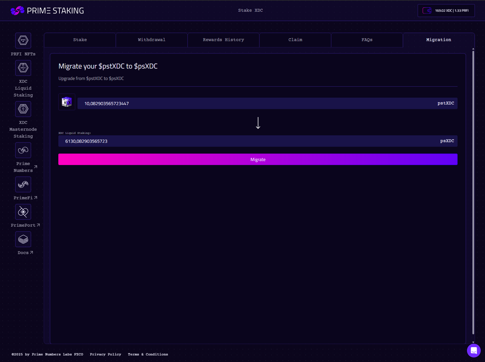

# Migration

If you hold the legacy **pstXDC** token, you can migrate it to the current **psXDC** token.

---

### Steps

1. Go to the **Migration** section in the app.
2. Click **Migrate** and confirm the transaction.
3. Your pstXDC will be converted to psXDC at a 1:1 ratio.

<figure><figcaption></figcaption></figure>

<figure><figcaption></figcaption></figure>


Migration is only required for users who staked before the psXDC upgrade. New users receive psXDC directly.

