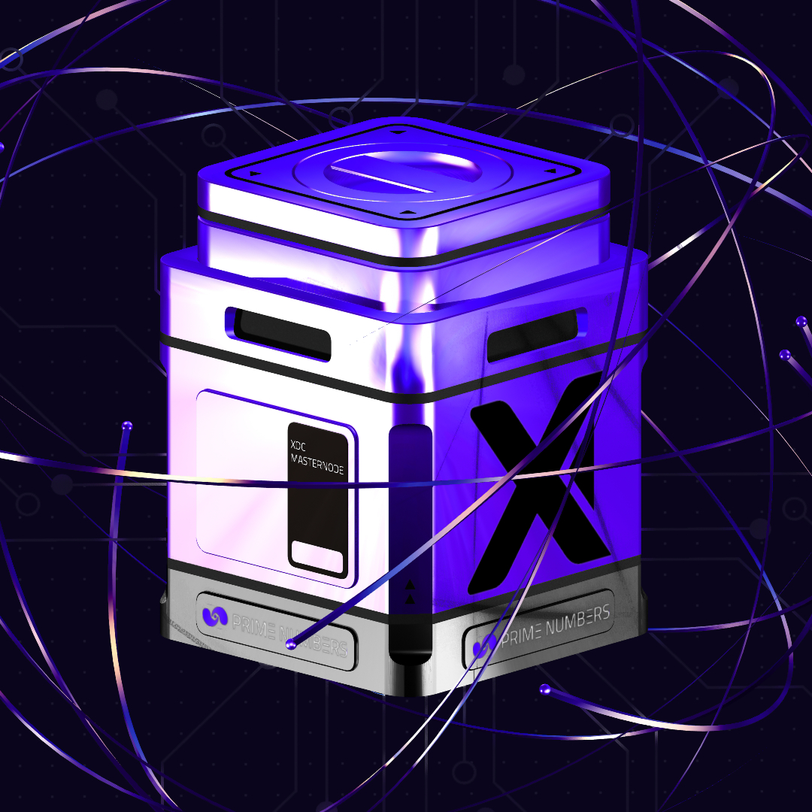

# XDC Masternode Vaults

XDC Masternode Vaults are specialized staking Vaults designed for users with a minimum of 10 million $XDC tokens who wish to operate an XDC masternode. These Vaults simplify the process of running a masternode, managing rewards, and covering operational expenses, while also providing liquidity through $pstXDC tokens.

<figure><figcaption></figcaption></figure>

***

#### **What Are XDC Masternode Vaults?**

XDC Masternode Vaults function similarly to standard XDC Vaults but are exclusively for users with 10M $XDC required to mint the Vault. These Vaults allow users to stake $XDC, operate a masternode, and earn **7.65% APY** from the masternode rewards. Additionally, when staking 10M $XDC, users receive **10M $pstXDC** in their wallet, enabling liquidity through liquid staking derivatives.

***

#### **How It Works**

1. **Mint an XDC Masternode Vault:**
   * Users with 10M $XDC can mint an XDC Masternode Vault, represented as an NFT that manages the staked tokens.
2. **Receive Liquid Staking Tokens:**
   * When you stake 10M $XDC into the Vault, the system automatically mints **10M $pstXDC** and sends it to your wallet.
   * $pstXDC serves as proof of your staked tokens and can be freely used in the ecosystem, such as in DeFi protocols, without affecting your masternode rewards.
3. **Earn Masternode Rewards:**
   * Your staked $XDC generates rewards at **7.65% APY**, distributed proportionally to your Vault balance.
   * The platform retains **0.35% of the 8% APY** to cover hosting and operational fees.
4. **Liquidity Through $pstXDC:**
   * $pstXDC tokens maintain a 1:1 ratio with staked $XDC, allowing users to use their tokens in DeFi applications while still earning masternode rewards.
   * $pstXDC can be traded, staked in other protocols, or redeemed for the underlying $XDC.
5. **Redeem Your $XDC:**
   * To exit, click the **Request Withdraw XDC** button. This resigns the masternode and initiates the withdrawal process.
   * After a **32-day waiting period**, your $XDC, along with any rewards, will be available for redemption.
   * Redeeming $XDC burns the corresponding $pstXDC tokens.

***

#### **Key Features**

1. **Liquid Staking:**
   * Users receive **10M $pstXDC** for every 10M $XDC staked, providing liquidity and flexibility while maintaining staking rewards.
2. **Transparent Rewards:**
   * Earn **7.65% APY** directly from masternode operations. Rewards are automatically credited to the Vault and visible on the platform dashboard.
3. **No Hosting Hassles:**
   * The platform handles hosting and operational management, deducting a minimal **0.35% APY** from the total rewards.
4. **Effortless Withdrawal Process:**
   * Users can easily resign their masternode and withdraw their $XDC in **32 days**, ensuring a smooth exit.

***

#### **Step-by-Step Guide**

1. **Mint an XDC Masternode Vault:**
   * Ensure you have 10M $XDC in your wallet.
   * Access the staking platform and mint an XDC Masternode Vault NFT.
   * Confirm the transaction to lock your $XDC into the Vault.
2. **Receive $pstXDC Tokens:**
   * After staking, 10M $pstXDC will be minted and sent to your wallet.
3. **Use $pstXDC Tokens:**
   * Utilize $pstXDC in DeFi protocols while your staked $XDC continues to generate rewards.
4. **Track Rewards:**
   * Log into the platform dashboard to monitor rewards from your masternode stake.
5. **Withdraw Your $XDC:**
   * To withdraw, redeem your $pstXDC and initiate the **Request Withdraw XDC** process.
   * Wait 32 days to complete the withdrawal and receive your original $XDC and accrued rewards.

***
