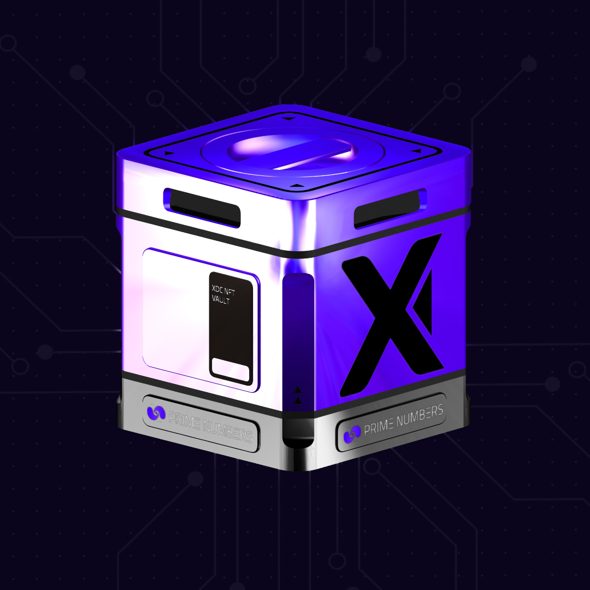

# XDC Vaults

XDC Vaults are integral to the XDC Liquid Staking System, providing a secure and efficient mechanism for staking $XDC tokens and receiving staking derivatives ($pstXDC). These vaults simplify the staking process, remove traditional barriers, and unlock new opportunities for XDC holders.

<figure><figcaption></figcaption></figure>

***

#### **What Are XDC Vaults?**

XDC Vaults are on-chain smart contract-based storage solutions where users deposit their $XDC tokens for staking. Upon depositing, users receive $pstXDC, a liquid staking derivative representing their staked $XDC.

***

#### **Key Features**

1. **Staking Interface:**
   * XDC Vaults are the liquid staking system's gateway for staking $XDC.
   * Users can mint a Vault directly from the staking platform and deposit their $XDC tokens. It costs only 100 XDC to mint an XDC Vault.
2. **$pstXDC Minting:**
   * Once $XDC tokens are deposited, the vault automatically issues an equivalent amount of $pstXDC to the user’s wallet.
   * The $pstXDC tokens maintain a 1:1 ratio with staked $XDC and serve as proof of ownership.
3. **Rewards Accrual:**
   * While $XDC is locked in the Vault, it participates in the masternode system to generate staking rewards.
   * Rewards are credited periodically to the user’s Vault and reflected in the overall balance of staked tokens.
4. **Liquidity Through $pstXDC:**
   * $pstXDC tokens are liquid and can be used in various DeFi applications, such as lending, trading, or providing liquidity.
   * Non-Locked: Users can use $pstXDC at any time to withdraw their original $XDC and accumulated rewards.
5. **Flexible Exit:**
   * Upon unstaking, $pstXDC is burned, and the equivalent amount of $XDC is returned to the user’s wallet.

***

#### **How to Use XDC Vaults**

1. **Mint an XDC Vault:**
   * Navigate to the XDC Staking platform and select the option to mint a new Vault.
   * Confirm the transaction to deploy the smart contract for your Vault.
2. **Deposit $XDC Tokens:**
   * Transfer the desired amount of $XDC into the Vault through the staking platform interface.
   * Confirm the deposit transaction.
3. **Receive $pstXDC:**
   * Upon deposit, $pstXDC tokens are automatically issued to your wallet.
4. **Manage Rewards and Withdrawals:**
   * Monitor your Vault for accrued staking rewards.
   * To withdraw, use your $pstXDC, and your original $XDC plus rewards will be returned to your wallet.

***

#### **Technical Details**

1. **Reward Mechanism:**
   * Rewards are calculated dynamically based on protocol performance and distributed directly to Vault balances.
2. **Transparency:**
   * All Vault transactions are recorded on-chain, providing users with a clear and auditable trail of their staking activity.

***

#### **Benefits of XDC Vaults**

1. **Simplified Staking Process:**
   * XDC Vaults eliminate the need for complex setups or high entry barriers, making staking accessible to all users.
2. **Liquidity with $pstXDC:**
   * $pstXDC provides flexibility, enabling users to participate in DeFi while their $XDC continues to earn rewards.
3. **No Hosting Costs:**
   * The system removes the technical requirements of masternode hosting, saving time and expenses.
4. **Scalability:**
   * XDC Vaults are designed to support a large number of users and adapt to protocol upgrades seamlessly.

***

#### **Future Integrations**

* **DeFi Applications:** $pstXDC tokens will integrate with lending platforms, decentralized exchanges, and other DeFi protocols to enhance utility.
* **Enhanced Features:** Additional functionalities, such as automated reward compounding and multi-asset staking, are planned for future releases.

***

XDC Vaults provide a robust, user-friendly solution for staking $XDC, allowing token holders to earn rewards while maintaining liquidity. With secure smart contracts and seamless integration into the XDC ecosystem, Vaults are a cornerstone of the XDC Liquid Staking System.
